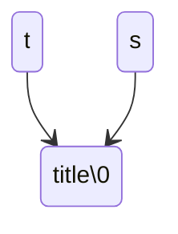
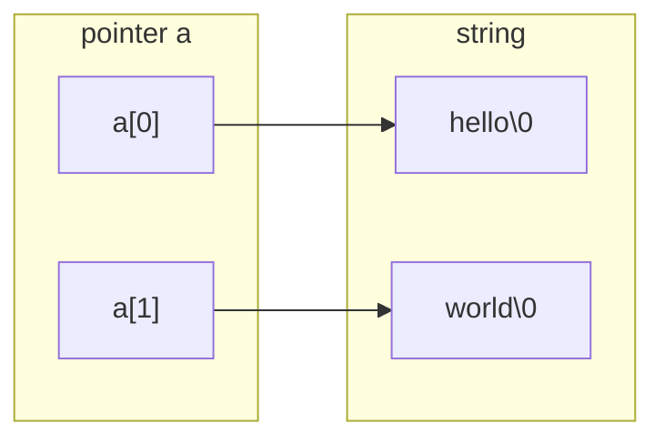
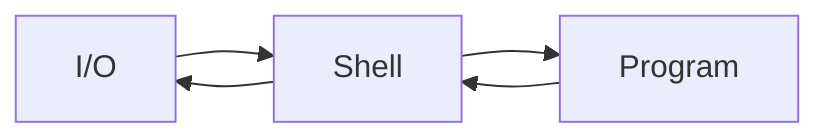

[TOC]

# 10

## 10.1.1

### 字符串

#### 字符数组

```c
char word[]={'H','e','l','l','o'，'!'};
```

#### 字符串

```c
char word[]={'H','e','l','l','o','!','\0'};
//以0（整数0）结尾的一串字符
char word[]={'H','e','l','l','o','!',0};//可等价
char word[]={'H','e','l','l','o','!','0'};//不可等价
```

- 计算字符串长度时不包含这个`0`
- 字符串以==数组==形式存在，以<u>**数组**</u>或者<u>**指针**</u>形式访问
- `string.h`有很多处理字符串的函数

!!! question
    >
    > 问题：如果我想在字符串中包含一个 `\0` 字符而不终止字符串怎么办❓❓❓
---
#### 字符串变量

```c
char *str="Hello";
char word[]="Hello";
char line[10]="Hello";
```

#### 字符串常量

- “Hello”会被编译器变成一个**字符数组**放在某处，这个数组的长度是6，结尾还有表示结束的0
- 两个**相邻**字符串常量会被连在一起

!!! note
    >
    > - C语言的字符串是以字符数组的形态存在的
    >   - **不能用运算符**对字符串做运算
    >   - 通过数组的方式可以遍历字符串

## 10.1.2

### 字符串变量

```c
int main( ) {

    int i=0;
    char *s = "Hello World!";
    char *s2= "Hello World!";

    printf("s= %p\n",s);//s= 00007ff6da3cb000
    printf("s2=%p\n",s2);//s2=00007ff6da3cb000
    printf("s3=%p\n",s3);//s3=0000006ed63ff7ff
    printf("i=%p\n",&i);//i=0000002d14bffb7c
    
    return 0;
}
```
- **指针**s和s2指向**同一地址**，所以不能随意修改数组中元素，否则改了s也会影响s2

- s实际上是`const char *s`，**只读**

- 要==修改==字符串，应该用**数组**

  - ```c
    char s[]="Hello,world!";
    ```
    
---

### 指针还是数组？
- 指针还是数组？
	- 数组
		- 这个字符串在这里

			- 作为本地变量被自动回收

	- 指针
    	- 这个字符串不知道在哪里
    		- 处理参数
    		- 动态分配内存

!!! tip
    >
    > **构造**字符串→数组
    >
    > **处理**一个字符串→指针

#### `char*`是字符串？

- 字符串**可以是**`char*`形式
- `char*`**不一定**是字符串
  - 本意是指向字符的指针，可能指向的是字符的数组(像int*)
  - 只有所指向的字符数组**结尾有0**，才能说它所指的是字符串

## 10.1.3

### 字符串的输入/输出

```c
char *t="title";
char *s;
s=t;
```



并没有创造一个新的`s`，而是都指向`title\0`

```c
int main(void) {
    char word[8];
    scanf("%s", word);//hello world
    printf("%s##\n", word);//hello##

    return 0;
}
```

```c
int main(void) {
    char word[8];
    char word2[8];
    scanf("%s", word);//hello
    scanf("%s",word2);//world
    printf("%s##%s##\n", word,word2);//hello##world##

    return 0;
}
```

- `scanf`读入一个单词（到空格、tab、回车为止）
- `scanf`不安全→不知道要读入的内容的长度

```c
int main(void) {
    char word[8];
    char word2[8];
    scanf("7%s", word);//12345678
    scanf("7%s",word2);
    printf("%s##%s##\n", word,word2；//1234567##8##

    return 0;
}
```

!!! tip
    >
    > #### **安全输入**
    >
    > `%ns`限定输入字符串长度

### 常见错误

```c
char *string;
scanf("%s",string);
```

- 以为`char*`是字符串类型，定义了一个字符串类型的变量string就可以直接使用
  - 没有对`string`初始化为`0`，并不一定每一次都出错

### 空字符串

```c
char buffer[100]="";
//buffer[0]=='\0'
```

```c
char buffer[]="";
//这个数组长度则为1，因为未定义长度
```

## 10.1.4

### 字符串数组

| 代码           | 含义                                                         |
| -------------- | ------------------------------------------------------------ |
| ①`char **a`    | a是一个指针，指向那一个指针，那个指针指向一个字符（串）      |
| ②`char a[][n]` | 二维字符数组                                                 |
| ③`char *a[]`   | 表示一个字符**指针数组**。这里的每个元素都是一个指向字符的指针 |

② vs ③：

- `char a[][10]`适用于存储**固定长度**的多个字符串。
- `char *a[]`更灵活，可以存储**不同长度**的字符串，但需要注意内存管理。



```c
int main() {
    const char *months[] = {
        "January", "February", "March", "April",
        "May", "June", "July", "August",
        "September", "October", "November", "December"
    };

    int month;
    printf("Enter month number (1-12): ");
    scanf("%d", &month);

    if (month >= 1 && month <= 12) {
        printf("The month is: %s\n", months[month - 1]);
    } else {
        printf("Invalid month number! Please enter a number between 1 and 12.\n");
    }

    return 0;
}

```

### 程序参数❓❓❓

```c
int main(int argc, char const *argv[])
```

```c
int main(int argc,char const *argv[]) {
    int i=0;
    for(i=0;i<=argc;i++) {
        printf("%d:%s\n",i,argv[i]);
    }
    return 0;
}
/*
0:C:\Users\Devlin\CLionProjects\untitled1\cmake-build-debug\untitled1.exe
1:(null)
*/
```

`argc` 是 "argument count" 的缩写，表示命令行参数的数量。

`argv` 是 "argument vector" 的缩写，表示一个字符串数组（指向字符常量的指针数组），用于存储命令行参数的实际值。

## 10.2.1

### 单字符输入输出❓❓❓

#### `putchar`

```c
int putchar(int c);
```

- 向**标准输出**写一个字符
- 返回写了几个字符，`EOF(-1)`表示写失败

#### `getchar`

- 从**标准输入**读入一个字符
- 返回类型是`int`是为了返回`EOF(-1)`
  - Windows→Ctrl-Z
  - Unix→Ctrl-D

```c
int main(int argc,char const *argv[]) {
    int ch;

    while((ch=getchar())!=EOF) {
        putchar(ch);
    }
    printf("EOF\n");
    return 0;
}
```



## 10.2.2

### 函数`strlen`

```c
#include <string.h>
```

```c
//实质
size_t strlen(const char *s)；
```

```c
int main(int argc, char const *argv[]) {
    char line[]="Hello";
    printf("strlen=%lu\n", strlen(line));//strlen=5
    printf("sizeof=%lu\n",sizeof(line));//sizeof=6

    return 0;
}
```

#### 自己写出`strlen`

```c
int mystrlen(const char *s) {
    int index =0;
    while (s[index] != '\0') {
        index++;
    }
    return index;
}
```

## 10.2.3

### 函数`strcmp`

```c
int main(int argc,char const *argv[]) {
    char s1[]="abc";
    char s2[]="Abc";//a,A在ASCII码表中差32
    printf("%d\n",s1==s2);
    printf("%d\n",strcmp(s1,s2));//32  →  'a'-'A'==32

    return 0；
}
```

```c
int main(int argc,char const *argv[]) {
    char s1[]="abc";
    char s2[]="abc ";//多一个空格 空格在ASCII码中是32
    printf("%d\n",s1==s2);
    printf("%d\n",strcmp(s1,s2));//-32 

    return 0；
}
```

#### 自己写出`strcmp`

```c
//①用数组
int mystrcmp(const char *s1, const char *s2) {
    int index =0;
    while(s1[index]==s2[index] && s1[index] != '\0') {
        index++;
    }
    return s1[index] - s2[index];
}
//②用指针
int mystrcmp(const char *s1, const char *s2) {
    while(*s1==*s2 && *s1 != '\0') {
        s1++;
        s2++;
    }
    return *s1-*s2;
}
```

## 10.2.4

### 函数`strcpy`

```c
 char *strcpy(char *restrict dst,const char *restrict src);
//把src内容拷贝到dst中
```

!!! warning
    >
    > `restrict`表明`src`和`dst`**==不重叠==**(C99)
    >
    > 返回`dst`→为了**链起**代码来❓❓

### 复制一个字符串

```c
char *dst=(char *)malloc(strlen(src)+1);
strcpy(dst,src);
```

自己写出`strcpy`

```c
//①用数组
char *mystrcpy (char *dst, const char *src) {
    int index =0;
    while (src[index] != '\0') {
        dst[index] = src[index];
        index++;
    }
    dst[index] = '\0';
    return dst;
}
//②用指针
char *mystrcpy (char *dst, const char *src) {
    char *ret = dst;
    while (*src != '\0') {
        *dst++ = *src++;
    }
    /*
    可以精简while语句
    while(*dst++=*src++);
    该句隐含判断了*src是0
    */
    *dst = '\0';
    return ret;
}
```

## 10.2.6

### 函数`strchr`

```c
char *strchr(const char *str, int c);//从左找
char *strrchr(const char *str, int c);//从右找
//返回NULL表示没找到
```

#### e.g.如何寻找第二个？

```c
int main(void) {
    char s[]="Hello";
    char *p=strchr(s,'l');
    p =strchr(p+1,'l');//在已经找到的字符串“llo”中继续寻找
    printf("%s\n",p);
    return 0;
}
```

#### e.g.如何将找到的存到另外一个字符串中

```c
int main(void) {
    char s[]="Hello";
    char *p=strchr(s,'l');
    char *t=(char*)malloc(strlen(p)+1);
    strcpy(t,p);
    printf("%s\n",t);
    free (t);
    return 0;
}
```

#### e.g.打印找到字符串前面的东西

```c
int main(void) {
    char s[]="Hello";
    char *p=strchr(s,'l');
    char c;
    c=*p;
    *p='\0';
    char *t=(char*)malloc(strlen(p)+1);
    strcpy(t,s);
    printf("%s\n",t);
    *p=c;
    free (t);
    return 0;
}
```

### 函数`strstr`

寻找字符串

### 函数`strcasestr`

忽略大小写寻找字符串
