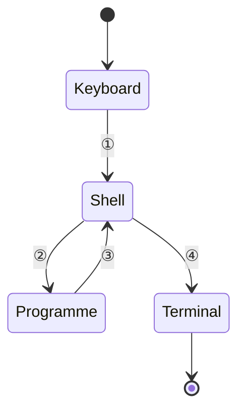
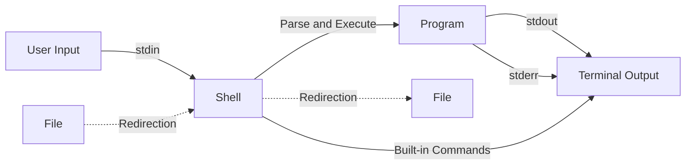

[TOC]

# 6

## 6.1.1-6.1.7

### 编程练习解析（暂时跳过❗❗❗❗）

## 6.2.1

### 数据类型

- C语言变量必须
  - 提前定义
  - 确定类型

- C++/Java：更加强调类型
- JS/Python/PHP：不看重类型，甚至不用事先定义

| 整数   | char、short、int、long、long long |
| ------ | --------------------------------- |
| 浮点数 | float、double、long double        |
| 逻辑   | bool                              |
| 指针   |                                   |
| 自定义 |                                   |


!!! note
    > 类型名称：`int、long、double`
    > 输入输出时的格式化：`%d、%ld、%lf`
    > 所表达的数的范围：`char < short< int < float <double`
    > 内存中所占据的大小：1个字节到16个字节
    > 内存中的表达形式：二进制数（补码）、编码

### 工具 （sizeof）

- 静态运算符

  ```c
  int main() {
  
   int a;
   a=6;
   printf("%ld",sizeof(a++));
   printf("%d",a);//输出仍然是6，前一句中的a++只在那一句生效->静态运算
  
   return 0;
  }
  ```

## 6.2.2

### 整数类型

| 类型      | 大小                                   |
| --------- | -------------------------------------- |
| char      | 1字节（8比特）                         |
| short     | short: 2字节                           |
| int       | 取决于编译器(CPU) ,通常的意义是“1个字” |
| long      | 取决于编译器(CPU) ,通常的意义是“1个字” |
| long long | 8字节                                  |

!!! note
    >
    > int就是用来表示寄存器（reg）的

## 6.2.3

### 整数的内部表达

#### *二进制负数

一个字节可以表达的数：0000 0000-1111 1111（0-255）

​	三种方案

​		1、仿照十进制，有一个特殊的标志表示负数
​			问题：需要1 0000 0001+ 0000 0001=0000 0000
​		2、取中间的数为0，如1000000表示0，比它小的是负数，比它大的是正数
​			问题：输入输出较为复杂
​		3、==补码==√

 1111 1111+0000 0001→==1== 0000 0000（多一位）

∵ ==1== 0000 0000-0000 0001→1111 1111

​        （0）      -      （1）  →     （-1）

该数被当作==纯二进制==为255，作为==补码==时则是-1

**补码的意义：拿补码和源码可以加出一个溢出的零**

## 6.2.4 

### 整数的范围

一个字节（8位）可以表示：0000 0000 ~1111 1111

1111 1111~1000 0000 →-1~-128

0000 0001~0111 1111 →1~127

```c
int main() {

    char c =255;//当作补码
    int i =255;//当作正常二进制
    unsigned char e=255;//强制当作正常二进制
    printf("c=%d,i=%d，e=%d\n",c,i);

    return 0;
}

-------------------
    c=-1,i=255，e=255
```

如果一个字面量常数想要表达自己是unsigned,可以在后面加u或U :e.g.`255U`
用I或L表示`long(long)`
*unsigned的初衷并非扩展数能表达的范围，而是为了**<u>做纯二进制运算</u>**，主要是为了移位

> 字面量：“123”
> 变量：a
>

!!! tip
    >
    > 数字可以理解成一个圈
    >
    > ```mermaid
    > stateDiagram-v2
    > 
    > 0--> －1
    > －1-->－128
    > －128-->127
    > 127-->0
    > 
    > 
    > 
    > 
    > ```
    >
    > ```mermaid
    > stateDiagram-v2
    > 
    > 0-->255
    > 255-->0
    > 
    > ```
    >

```c
int main() {

    int a=0,b=0;
    while (++a>0);
    printf("The biggest number is int is :%d\n",a-1);//什么时候转过一圈即可知道最大的数字

    b++;

    while((a=a/10)!=0) {
        b++;
    }

    printf("The biggest digit in int is : %d\n",b);
    return 0;
}
---------------------->
The biggest number is int is :2147483647//就是2的31次方-1
The biggest digit in int is : 10
```

```c
//另外一种方法（简单）
int main() {
    int a = 0;
    int bits = sizeof(int) * 8; // 获取 int 的位数
    printf("The biggest number in int is: %d\n", (1 << (bits - 1)) - 1);
    printf("The biggest digit in int is: %d\n", bits);
    return 0;
}
```

## 6.2.5

### 整数的输入输出

只有两种形式：`int`或`long long`
	`%d`: int
	`%u`: unsigned
	`%ld`: long long
	`%lu`: unsigned long long

8进制/16进制

- 8进制：0开头
- 16进制：0x开头

```c
int main() {

    char c = 012;
    int i= 0x12;
    printf("c=%d,i=%d\n",c,i);
    printf("c=%o,i=%x\n",c,i);
    return 0;
}
----------------->
c=10,i=18
c=12,i=12
```

!!! tip
    >
    > `%o`表示8进制；`%x`表示16进制
    
    - 16进制很适合表达二进制数据，因为4位二进制正好是一个16进制位
      - 8进制的一位数字正好表达3位二进制
        - 因为早期计算机的字长是12的倍数，而非8

## 6.2.6

### 选择整数类型

!!! tip
    >
    > 没有特殊需要，就选择`int`
    >
    > `unsigned`与否只是输出的不同，内部计算是一样的
    
    > ①现在的CPU的字长普遍是32位或64位，一次内存读写就是一个int，一次计算也是一个int，选择更短的类型不会更快，甚至可能更慢

    > ②现代的编译器一般会设计内存对齐，所以更短的类型实际在内存中有可能也占据一个int的大小（虽然sizeof告诉你更小)

## 6.2.7

### 浮点类型

| 类型   | 字长 | 范围                                    | 有效数字 | scanf | printf |
| ------ | ---- | --------------------------------------- | -------- | ----- | ------ |
| float  | 32   | ±(1.20x10^-38^~3.40x10^38^),0,±inf,nan  | 7        | %f    | %f,%e  |
| double | 64   | ±(2.2x10^-308^~1.79x10^308^),0,±inf,nan | 15       | %lf   | %f,%e  |

`%e`:科学计数法

```c
int main() {
    double ff =1E-10;
    printf("%E,%.16f\n", ff, ff);//.16表示输出位数：16位
    return 0;
}
```

```c
int main() {
    printf("%.3f\n", -0.0049);
    printf("%.30f\n", -0.0049);
    printf("%.3f\n", -0.00049);
    return 0;
}
--------------------->
-0.005
-0.004899999999999999841793218991
-0.000
```

## 6.2.8

### 浮点的精度和范围

```c
printf("%f\n",12.0/0);
printf("%f\n",-12.0/0);
printf("%f\n",0.0/0);、
-------------
inf
-inf
nan
```

!!! warning
    >
    > - `f1 == f2`可能失败，使用`fabs(f1-f2) < le-12`
    >   - `float`要用f/F后缀表明身份
    >   - 带小数点字面量是`double`，而不是`float`

!!! tip
    >
    > 没有特殊需要，只使用`double`

## 6.2.9

### 字符类型

```c
int main() {
    if (49=='1') {
        printf("Yep!\n");
    }
    return 0;
}
---------->
Yep!
```

### 字符计算

```c
char a='A';
a++;
printf("%d\n",a);
```

一个字符加一个数字得到ASCII码表中那个数之后的字符
两个字符的减，得到它们在表中的距离
字母在ASCII表中是顺序排列的
大写字母和小写字母是分开排列的，并不在一起

```c
//大小写转换
a+'a'-'A'//大写→小写
a+'A'-'a'//小写→大写
```

## 6.2.10

### 逃逸字符

| 字符 | 意义           |
| ---- | -------------- |
| \b   | 回退一格       |
| \t   | 到下一个表格位 |
| \n   | 换行           |
| \r   | 回车           |
| \\"  | 双引号         |
| \\'  | 单引号         |
| \\\  | 反斜杠本身     |


完整


注：`\b`之后跟东西，那个东西会替换前一个字符

### 制表位

`1tab=\t`

## 6.2.11

### 类型转换

#### 自动

当运算符的两边出现不一致的类型时，会自动转换成较大的类型
大:能表达的数的范围更大
`char-> short-> int-> long-> long long`
`int -> float -> double`

#### 强制

要把一个量强制转换成另一个类型（通常是较小的类型)，需要：

（类型）值：

```c
(int) 10.1;
(short)32;
(short)32768;//注意安全性：小的变量不总能表达大的量  --> -32768
```

强制类型转换优先级高于四则运算

```c
int i= (int) a/b
int i= (int) (a/b)
```

## 6.3.1

### 逻辑类型

```c
#include <stdbool.h>
//之后就可以使用bool和true、false 
```

```c
bool c=6>5;
bool t=true;
t=2//布尔量仍然是整数，输出是0/1
```

## 6.3.2

### 逻辑运算

|      | 逻辑运算 | 逻辑量     |
| ---- | -------- | ---------- |
| 结果 | 0/1      | true/false |

| 运算符 | 描述   | 示例   | 结果                                                        |
| ------ | ------ | ------ | ----------------------------------------------------------- |
| ！     | 逻辑非 | !a     | 如果a是true结果就是false,  如果a是false结果就是true         |
| &&     | 逻辑与 | a&&b   | 如果a和b都是true,结果就  是true;否则就是false               |
| \|\|   | 逻辑或 | a\|\|b | 如果a和b有一个是true,结果为true;  两个都是false,结果为false |

e.g. 4<x<6❌ --> x>4&&x<6✔️

​	判断是否是大写字母：c>='A'&&c<='Z'✔️

​	!age<20-->结果一定是true  ∵！age结果是0/1

### 优先级

!!! note
    >
    > `！>&&>||`

e.g. `!done&&(count>MAX)`

### 短路

逻辑运算是自左向右进行的，如果左边的结果已经能够决定结果了，==就不会做右边的计算==

e.g. 对于&&：左边false-->不做右边

​	对于||：左边true-->不做右边

!!! bug
    >
    > 不要把赋值，包括复合赋值组合进表达式
    >
    > e.g. `a==1&&b+=6`

## 6.3.3

### 条件运算/逗号运算

#### 条件运算符

```c
count=(count>20)? count-10:count+10;
//      (条件)     (满足时) (不满足时)
```

优先级：比赋值高但是低于其他运算符

##### 嵌套条件表达式

`count = (count > 20) ? (cout < 50) ? count - 10 :count - 5 :(count<10 ) ? count+ 10: count + 5;`

条件计算自右向左：先计算分支，再汇总

#### 逗号运算

e.g. 在for中使用：`for(i=1,j=10 ; i<j ; i++,j--)`
