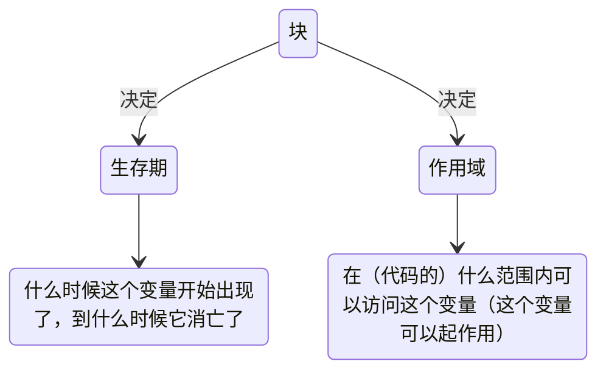

[TOC]

# 7

## 7.1.1

#### 初见函数

“代码复制”是程序不良的表现

→包装成函数

## 7.1.2

### 函数的定义和使用

$$
y=f(x)
$$

接受参数，返回值

```c
void sum(int begin, int end)										//函数头
{																  //函数体{}
    int i;
    int sum=0;
    for(i=begin;i<=end;i++){
        sum+=i;
    }
    printf("The sum of %d to %d is %d : ",begin,end,sum);
}
```

`void`：返回类型

`sum`：函数名

`(int begin, int end)`：参数表

### 调用函数

- 函数名（参数值）
- （）起到表示函数调用的作用
  - 即使没有参数也要（）
- 如果有参数，需要给出正确的数量和顺序


```c
void cheer() {
    printf("Cheer!");
}

int main() {
    cheer();			//注意要有()
    return 0;
}
```

```c
int sum(int begin,int end) {

    int i;
    int sum=0;
    for (i=begin;i<=end;i++) {
        sum+=i;
    }
    return sum;
}

int main() {


    printf("%d\n",sum(1,10));
    return 0;
}
```

## 7.2.3

### 从函数返回

`return`停止函数执行，并送回一个值

```c
//两种写法
return;
return something	//+返回值
```

一个函数中可以有多个return语句

```c

int max(int a,int b) {
    if(a>b){
        return a;
    }
    else{
        return b;
    }
}
//此处函数有多个出口，可以这么写但不建议
int main() {
    printf("The bigger one is :%d",max(10,20));
    return 0;
}
```

### 没有返回值的函数

- void 函数名（参数表）
- 不能使用带值的return
  - 可以没有return
- 调用的时候不能做返回值的赋值

!!! danger
    >
    > 如果函数有返回值，必须使用带值的`return`

## 7.2.1

### 函数原型

#### 函数先后关系

把sum()写在上面，因为：

- C的编译器自上而下分析你的代码

!!! note
    >
    > 一般：函数要写在调用之前
    >
    > 解决：可以将==函数头==搬到程序前，以达到让main程序一目了然→==原型声明==
    >
    > ```c
    > int max(int a,int b);			//声明
    > int max(int ,int );				//省去参数名称也是可以的，不好读
    > 
    > int main() {
    > 
    >     printf("The bigger one is :%d",max(10,20));
    >     return 0;
    > }
    > 
    > int max(int a,int b) {			//定义
    >     if(a>b){return a;}
    >     else{return b;}
    > }
    > ```

## 7.2.2

### 参数传递

```c
int cheer(int i){
    printf("cheer!%d\n",i);
}

int main(){
    cheer(2.4);
    return 0;
}
----------------->
cheer 2
```

#### 类型不匹配

- 调用函数时给的值与参数的类型不匹配是C语言传统上最大的漏洞

- 编译器总是悄悄替你把类型转换好，但是这很可能不是你所期望的

- 后续的语言，C++/Java在这方面很严格

#### 传过去的是什么？

```c
void swap(int a,int b);
int main() {
    int a,b;
    printf("Enter two numbers:");
    scanf("%d %d",a,b);
    swap(a,b);

    printf("The numbers after swapping are:%d %d",a,b);
    return 0;
}

void swap(int a,int b) {
    int t=b;
    b=a;
    a=t;
}
//这段代码并不能达到交换两数的效果→每个函数都有自己的变量空间
```

!!! warning
    >
    > C在调用函数时，永远只能传值给函数

## 7.2.3

### 本地变量

- 函数的每次运行，就产生了一个独立的变量空间，在这个空间中的变量，是函数的这次运行所独有的，称作本地变量
- 定义在函数内部的变量就是本地变量
- 参数也是本地变量

生存期：什么时候这个变量开始出现了，到什么时候它消亡了
作用域：在（代码的）什么范围内可以访问这个变量（这个变量可以起作用）
对于本地变量，这两个问题的答案是统一的：大括号内——块




!!! tip
    >
    > - 本地变量是定义在块内的
    >   - 它可以是定义在函数的块内
    >   - 也可以定义在语句的块内
    >   - 甚至可以随便拉一对大括号来定义变量
    >   - 程序运行进入这个块之前，其中的变量不存在，离开这个块，其中的变量就消失了
    >   - 块外面定义的变量在里面仍然有效
    >   - 块里面定义了和外面同名的变量则掩盖了外面的
    >   - 不能在一个块内定义同名的变量
    >   - 本地变量不会被默认初始化
    >   - 参数在进入函数的时候被初始化了

## 7.2.4

### 没有参数时

```c
void f()		//不建议，表示参数未知
void f(void)	//表示没有参数
```

C语言不允许函数嵌套定义

`int main`也是函数

`return 0;`作用→   Windows: if errorlevel 1……
				Unix Bash: echo $?
				Csh: echo$status

