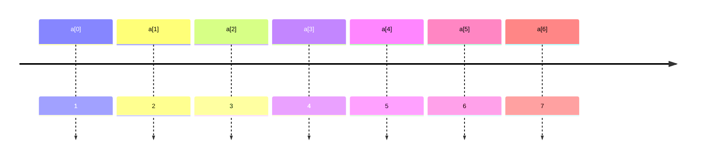

[TOC]

# 8

## 8.1.1

### 初试数组

```c
int main() {
    int x;
    int sum=0;
    int count=0;
    int number[100];

    scanf("%d",&x);
    while(x!=-1) {
        number[count]=x;
        //
        {
            int i;
            printf("%d\t",count);
            for(i=0;i<=count;i++) {
                printf("%d\t",number[i]);
            }
            printf("\n");
        }
        //
        sum=sum+x;
        count++;
        scanf("%d",&x);
    }
   
    if(count>0){

        printf("The average of all numbers is %f\n", 1.0*sum/count);
        int i;

        for(i=0;i<count;i++){

            if (number[i]>sum/count){
                printf("%d\n",number[i]);
            }
        }
    }
    return 0;
}
```

> 这个程序存在安全隐患：数组长度大于100

## 8.1.2

### 定义数组

```c
//  <类型> 变量名称 [元素数量]
e.g. int grades   [100]
    double weight [20]
```

!!! tip
      >
      > 元素数量必须是整数，而且是确定的字面量
      >
      > - 所有元素数据类型相同
      >   - 一旦创建不能改变大小
      >   - *（数组中元素在内存中是连续依次排列的）
      > 
      >下标从0开始



`a[2]=a[1]+6`：赋值左边的叫左值

### 有效的下标范围

- 编译器和运行环境都==不会==检查数组下标是否越界
- 一旦程序运行，越界的数组访问可能造成问题，导致程序崩溃→segmentation fault
- 长度为0的数组存在，但是无用

## 8.1.3

### e.g. 统计个数

```c
int main(void) {
    const int number = 10;//数组大小
    int x;
    int count[number];//定义数组
    int i;
    
    //数组初始化
    for (i = 0; i < number; i++) {
        count[i] = 0;
    }


    scanf("%d", &x);
    while (x != -1) {
        if (x > 0 && x <= 9) {
            count[x]++;//数组参与运算
        }

        scanf("%d",&x);
    }
    //遍历数组输出
    for (int i = 0; i < number; i++) {
        printf("%d:%d\n", i, count[i]);
    }


    return 0;
}
```

## 8.2.1

### 数组运算

#### 数组的集成初始化

```c
int a[]={2,4,6,8,9,6,5,3};
int a[12]={2};//第一个是2，其余是0
```

#### 集成初始化的定位

```c
int a[12] = { [1]=2,4,  [5]=6};//第2，3个是‘2，4’，第6个是‘6’
```

#### 数组的大小

sizeof给出整个数组所占据的内容的大小，单位是字节

```c
int main(void) {
    int a[]={4,5,6,7,8,9,10,11,12,13};
    {
        int i=0;
        printf("%llu",sizeof(a)/sizeof(a[0]));
    }
    return 0;
}
```

```c
sizeof(a)/sizeof(a[0])
    //这样的代码，一旦修改数组中初始的数据，不需要修改遍历的代码
```

#### 数组的赋值和遍历数组

```c
//错误❌
int a[]={1,2,3,4,5,6};
int b[]=a;
//正确✔️
int a[]={1,2,3,4,5,6};
for (i=0; i<length; i++){
    b[i]=a[i];
}
```

通常使用for循环，变量i从0到==<==数组长度

!!! warning
      >
      > 常见错误：❌
      >
      > - 循环结束条件：用<=数组长度
      >   - 离开循环后，仍旧用i的值来做数组下标

数组作为函数参数时，往往必须用另一个参数传入数组的大小

## 8.2.2

### e.g.数组例子：素数

1. 遍历0~n

```c
int isPrime(int x) {
    int ret = 1;
    for (int i = 2; i < x; i++) {
        if (x % i == 0) {
            ret = 0;
            break;
        }
    }

    return ret;
}

int main() {
    int x;
    scanf("%d", &x);
    if (isPrime(x) == 1) {
        printf("YES\n");
    } else {
        printf("NO\n");
    }
    return 0;
}
```

2. 遍历0~n（去掉所有偶数）
3. 遍历0~`sqrt(x)`
4. 判断是否能被已知的素数整除

```c
prime [count++]=i;
```
5. 构造素数表（埃拉托斯特尼筛法）
   （1）令x为2
   （2）将2x、3x、4x直至ax<n的数标记为非素数
   （3）令x为下一个没有被标记为非素数的数，重复（2）；直到所有的数都已经尝试完毕

   
   
   ```flow
   st=>start: Start
   e=>end: End
   op1=>operation: Create list 2 to n
   op2=>operation: Mark smallest unmarked number as prime
   op3=>operation: Cross out its multiples
   cond=>condition: Unmarked numbers left?
   op4=>operation: Output prime numbers
   
   st->op1->op2->op3->cond
   cond(yes)->op2
   cond(no)->op4->e
   ```
   
   

## 8.2.3

### 二维数组

```c
//3行5列的矩阵
int a[3][5]
```

`a [i][j]`是一个`int`

#### 二维数组初始化

```c
int a[][5]{
    {0,1,2,3,4},
    {2,3,4,5,6},
};
```

- 列数必须给出
- 一行一个{}，逗号分隔
- 省略表示补零
- 也可以使用定位

