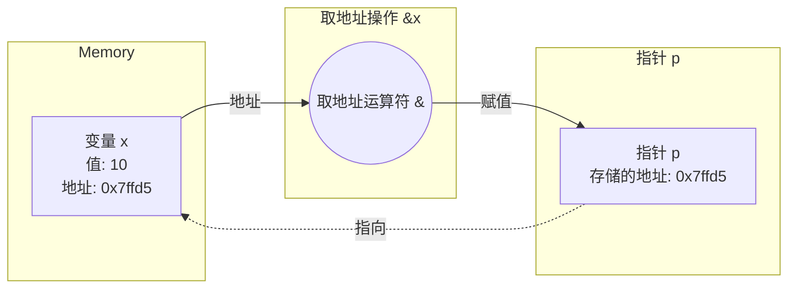
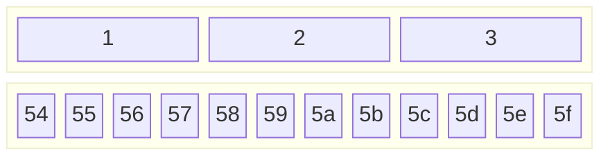
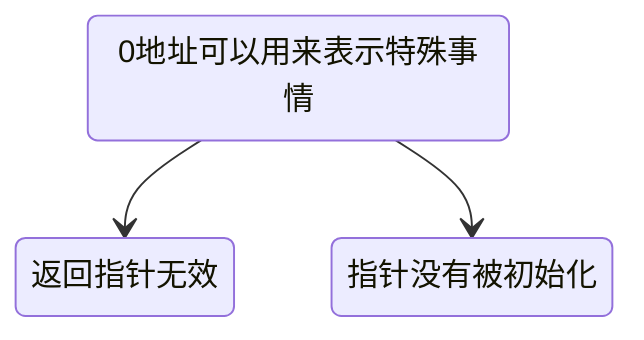
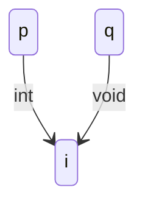

[TOC]

# 9

## 9.1.1

### 取地址运算

#### 运算符`&`

获得变量的地址，它的操作必须是地址

!!! BUG
    >
    > 地址大小是否与`int`相同取决于编译器
    >
    > `&(a±b)`不能取地址
    >
    > ```c
    > printf("%p",&i);//&i 表示打印变量地址
    > ```

## 9.1.2

### 指针

就是==保存地址==的变量

```c
int *p = &i;
int *p,q;//p是指针，q是int→ *p是一种类型，没有int*这种类型
```

### 访问地址上的变量`*`



```c
int main(void) {
    int *p;
    int a=8;
    p=&a;
    printf("%d\n",*p);//→8				 ：*p指向值
    printf("%p\n",p);//→0000005ff6bffaa4   ：p表示地址
    return 0;
}
```

```c
void f(int *p);
void g(int k);
int main(void) {
    int i =6;
    printf("&i=%p\n",&i);
    f(&i);
    g(i);
    return 0;
}

void f(int *p) {
    printf("p=%p\n",p);
    printf("*p=%p\n",*p);
    *p=26;//通过指针修改值
}

void g(int k) {
    printf("k=%d\n",k);
}
----------------------------->
&i=000000050cfffd7c
p=000000050cfffd7c
*p=0000000000000006
k=26
```

## 9.1.3

### 指针的使用

#### 1、两个变量做交换（之前变量都有限定的作用域）

```c
void swap(int *pa, int *pb);

int main(void) {
    int a=5;
    int b=6;
    swap (&a,&b);
    printf("a=%d, b=%d\n",a,b);
    return 0;
}
void swap(int *pa, int *pb) {
    int t =*pa;
    *pa=*pb;
    *pb=t;
}
```

#### 2、函数返回多个值，某些值要指针带回（==return只能返回一个值==）

```c
void minmax(int a[],int len,int *max,int *min);

int main (void) {
    int a[]={1,2,3,4,5,6,7,8,9,10,11,12,13,14,15};
    int min,max;
    minmax(a,sizeof(a)/sizeof(a[0]),&max,&min);
    printf("min = %d,max = %d\n",min,max);
    return 0;
}

void minmax(int a[],int len,int *max,int *min) {
    int i;
    *min =*max =a[0];
    for (i=1;i<len;i++) {
        if (a[i]<*min) {
            *min = a[i];
        }
        if (a[i]>*max) {
            *max = a[i];
        }
    }

}
```

3、函数返回运算的状态，结果通过指针返回

​	常用套路：让函数返回i特殊的不属于有效范围的值表示出错→-1/0

```c
int divide(int a, int b,int *result);

int main() {
    int a=5;
    int b=2;
    int c;
    if(divide(a,b,&c)) {
        printf("%d/%d=%d\n",a,b,c);
    }
    return 0;
}
int divide(int a, int b,int *result) {
    int ret =1;
    if (b==0) ret=0;
    else {
        *result=a/b;
    }
    return ret;
}
```

!!! bug
    >
    > **指针没有指向变量地址，就开始使用指针**

## 9.1.4

### 指针和数组

#### 传入数组成了什么？

```c
void minmax(int a[],int len,int *max,int *min);

int main (void) {
    int a[]={1,2,3,4,5,6,7,8,9,10,11,12,13,14,15};
    int min,max;
    printf("main sizeof(a)=%llu\n",sizeof(a));//→60
    printf("main a=%p\n",&a);//→00000077c0fffe00
    minmax(a,sizeof(a)/sizeof(a[0]),&max,&min);
    printf("min = %d,max = %d\n",min,max);
    return 0;
}
		//👇a[]和*a等价
void minmax(int a[],int len,int *max,int *min) {
    int i;
    printf("minmax sizeof(a)=%llu\n",sizeof(a));//→8
    printf("minmax a=%p\n",&a);//→00000077c0fffe00
    *min =*max =a[0];
    for (i=1;i<len;i++) {
        if (a[i]<*min) {
            *min = a[i];
        }
        if (a[i]>*max) {
            *max = a[i];
        }
    }
}
```

!!! note
    >
    > - 函数参数表中的数组其实是指针
    >   - `sizeof(a) == sizeof(int*)`

### 数组变量是特殊的指针

数组本身表达地址

```c
int a[10];int *p=a;//无需用&取地址
```

```c
a == &a[0];		  //数组单元表示变量，需要&取地址
```

`*`运算符可以对指针做也可以对数组做

```c
 *a =25；
```

数组变量是`const`指针，不能被复制

```c
int b[]->int *const b
```

## 9.1.5

### 指针与变量

```c
int i;
const int* p1 = &i;
int const *p2 = &i;
int *const p3 = &i;
```

!!! note
    >
    > `const`在`*`前：所指的东西不能被修改
    >
    > `const`在`*`后：指针不能被修改

### `const`数组

```c
const int a[]={1,2,3,4,5,6,};
//不可修改，必须初始化
```

## 9.2.1

### 指针运算

```c
int main(void) {
    //char
    char ac[]={0,1,2,3,4,5,6,};
    char *p =ac;
    printf("p= %p\n",p);
    printf("p+1= %p\n",p+1);

	//int
    int ai[]={0,1,2,3,4,5,6,};
    int *q =ai;
    printf("q= %p\n",q);
    printf("q+1= %p\n",q+1);
}
------------------------>
p= 0000006976dffbb9
p+1= 0000006976dffbba//+1
q= 0000006976dffb90
q+1= 0000006976dffb94//+4
```



- `*p    ->a[0]`
- `*(p+1)->a[1]`

并不是在地址上+1，否则没有意义

```c
int main(void) {
    char ac[]={0,1,2,3,4,5,6,};
    char *p =ac;//-->等价*p=&ac[0]
    char *p1=&ac[5];
    printf("p= %p\n",p);//p= 0000008992bff7c6
    printf("p1= %p\n",p1);//p1= 0000008992bff7cb
    printf("p1-p= %p\n",p1-p);//p1-p= 5

    //0000008992bff7c6[HEX] - 0000008992bff7cb[HEX]= 5[DEC]→ sizeof(char)*5
    
    int ai[]={0,1,2,3,4,5,6,};
    int *q =ai;
    int *q1=&ai[6];
    printf("q= %p\n",q);//q= 00000039e4bffaf0
    printf("q1= %p\n",q1);//q1= 00000039e4bffb08
    printf("q1-q= %p\n",q1-q);//q1-q= 6
   
    //00000039e4bffb08[HEX] - 00000039e4bffaf0[HEX]= 24[DEC]→ sizeof(int)*6
}
```

### `*p++`

```c
int main(void) {
    char ac[]={0,1,2,3,4,5,6,7,8,9,-1,};
    char *p =&ac[0];
//第一种遍历
    for(int i=0;i<sizeof(ac)/sizeof(ac[0]);i++) {
        printf("%d\n",ac[i]);
    }
//第二种遍历
    while(*p!=-1) {
        printf("%d\n",*p++);
    }
}
```

### `0`地址



**指针不应该具有0值**

`NULL`是一个预定定义的符号，表示`0`地址

- 有的编译器不愿意你用`0`来表示`0`地址

### 指针类型

指向不同类型的指针不能互相直接赋值←为避免用错指针

#### 指针类型转换

`void*` 表示不知道指向什么东西的指针

```c
int *p =&i;
void *q=(void*)p;
//通过p看i是int；通过q看i是void
```



## 9.2.2

### 动态内存分配

C99能用变量做数组定义的大小，之前呢？

```c
int *a=(*int)malloc(*n*sizeof(int));
//(int*) 将 void* 类型的指针强制转换为 int* 类型的指针，使其可以指向一个整数数组
```

```c
//malloc指令实质
void *           malloc(size_t _Size);
//指针指向内存                  当作整数  
```

```c
int main() {

    int number;
    int *a;
    int i;
    printf("Enter number:");
    scanf("%d", &number);//malloc 函数返回一个 void* 类型的指针
    a=(int*)malloc(number*sizeof(int));
    for(i=0;i<number;i++) {
        scanf("%d",&a[i]);
    }

    for(i=number-1;i>=0;i--) {
        printf("%d",a[i]);
    }

    free(a);// 释放之前动态分配的内存
    
    return 0;
}
```

### 没空间了？

申请失败返回`NULL(0)`

```c
int main(void) {
    void *p;// 定义一个指向 void 类型的指针变量 p，用于存放 malloc 分配的内存地址
    int count=0;
    while((p=malloc(100*1024*1024))) {//malloc 函数尝试分配 100MB 的内存（100 * 1024 * 1024 字节）
        count++;
    }
    printf("%d\n",count);//Given 58800MB of memory space
    return 0;
}
```

### `free()`

- 把申请过的空间还给“系统”
- 只能还申请来的空间的首地址

==良好习惯==：定义指针就<u>初始为0</u>

### 常见问题

- 申请了没有`free→长时间运行内存逐渐下降
- `free`过了再`free`
- 地址变过了，直接去`free`
