<h1 align='center'>
    1
</h1>

数据结构是在计算机中存储、组织数据的方式。小到变量、数组，大到线段树、平衡树，都是数据结构。

程序运行离不开数据结构，不同的数据结构又各有优劣，能够处理的问题各不相同，而根据具体问题选取合适的数据结构，可以大大提升程序的效率。所以，学习各种各样的数据结构是很有必要的。

[TOC]

# 1

## 1.1.1 数据结构基本概念

数据→数据**对象**→数据**元素**→数据**项**

## 1.1.2 数据结构三要素 

### 逻辑结构

集合、线性、树形、图状

### 数据的运算

基本运算：

①查找第`i`个数据元素

②在第`i`个位置插入新的数据元素

③删除第`i`个位置的数据元素

……

### 物理结构（存储结构）

在计算机**内部**表示**逻辑关系**

!!! note
    >
    > - 数据的存储结构会影响存储空间分配的方便程度
    >
    >   - 数据的存储结构会影响对数据运算的速度 

------

### *数据类型、抽象数据类型

- #### **数据类型**

​	是一个值的**集合**和定义在此集合上的**一组操作**的总称

​		1)**原子**类型：其值不可再分的数据类型

​		2)**结构**类型：其值可以再分解为若干成分（分量）的数据类型

- #### **抽象数据类型**

​	抽象数据类型(Abstract Data Type,**ADT**)是抽象数据组织及与之相关的操作。

## 1.2.1 算法基本概念

$$
程序=数据结构+算法
$$

### 算法特性

①有穷性→程序可以是无穷的的

②确定性：相同输入得到相同输出

③可行性：0/多个 输入
​		  1/多个 输出

④输入

⑤输出

## 1.2.2 算法的时间复杂度

## 1.2.3 算法的空间复杂度

> [!TIP]
>
> 算法**原地工作**：算法所需内存空间为**常量**

## 总结（算法效率度量）

