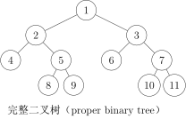
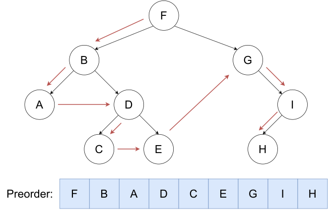
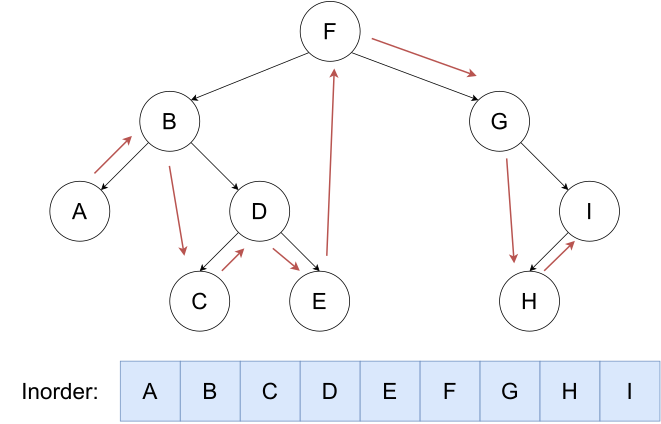
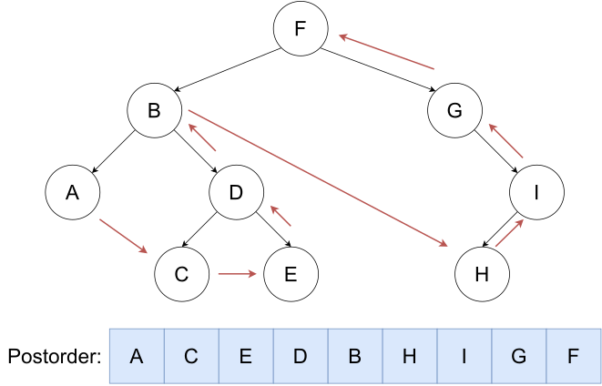
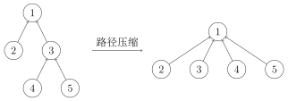

<h1 align="center">
Code Practice
</h1>

[TOC]

###### 


# 一、STL

## 1、==vector==
???+ tip
	顺序容器，**任意类型动态数组**

```c++
#include<bits/stdc++.h>
using namespace std;
int main() {
    int n;
    cin>>n;
    vector<int> v(n);
    for(int i=0;i<n;i++) {
        cin>>v[i];
    }
    for(int i=0;i<n;i++) {
        cout<<v[i]+1<<" ";
    }
}
```

---

```c++
v.resize(2*n);
cout<<v.size()<<endl;
```

```c++
 insert /pushback
```

---

### e.g.1# 【深基15.例2】寄包柜

题目描述

超市里有 $n(1\le n\le10^5)$ 个寄包柜。每个寄包柜格子数量不一，第 $i$ 个寄包柜有 $a_i(1\le a_i\le10^5)$ 个格子，不过我们并不知道各个 $a_i$ 的值。对于每个寄包柜，格子编号从 1 开始，一直到 $a_i$。现在有 $q(1 \le q\le10^5)$ 次操作：

- `1 i j k`：在第 $i$ 个柜子的第 $j$ 个格子存入物品 $k(0\le k\le 10^9)$。当 $k=0$ 时说明清空该格子。
- `2 i j`：查询第 $i$ 个柜子的第 $j$ 个格子中的物品是什么，保证查询的柜子有存过东西。

已知超市里共计不会超过 $10^7$ 个寄包格子，$a_i$ 是确定然而未知的，但是保证一定不小于该柜子存物品请求的格子编号的最大值。当然也有可能某些寄包柜中一个格子都没有。

输入格式

第一行 2 个整数 $n$ 和 $q$，寄包柜个数和询问次数。

接下来 $q$ 个行，每行有若干个整数，表示一次操作。

输出格式

对于查询操作时，输出答案，以换行隔开。

样例 #1

样例输入 #1

```
5 4
1 3 10000 118014
1 1 1 1
2 3 10000
2 1 1
```

样例输出 #1

```
118014
1
```

提示

$\text{upd 2022.7.26}$：新增加一组 Hack 数据。

```c++
#include<bits/stdc++.h>
using namespace std;

int main() {
    int n, q;
    cin >> n >> q;

    vector<vector<int> > A(n + 1);
    for (int i = 1; i <= q; i++) {
        int op;
        cin >> op;
        if (op == 1) {
            int I, j, k;
            cin >> I >> j >> k;
            if (A[I].size() < j + 1) {//in case there is no 'j'
                A[I].resize(j + 1);//resize the 'j'
            }
            A[I][j] = k;
        }
        if (op == 2) {
            int I, j;
            cin >> I >> j;
            cout << A[I][j] << endl;
        }
    }
}
```

---

## 2、 队列

---

### e.g.2# 约瑟夫问题

题目描述

$n$ 个人围成一圈，从第一个人开始报数,数到 $m$ 的人出列，再由下一个人重新从 $1$ 开始报数，数到 $m$ 的人再出圈，依次类推，直到所有的人都出圈，请输出依次出圈人的编号。


输入格式

输入两个整数 $n,m$。

输出格式

输出一行 $n$ 个整数，按顺序输出每个出圈人的编号。

样例 #1

样例输入 #1

```
10 3
```

样例输出 #1

```
3 6 9 2 7 1 8 5 10 4
```

提示

$1 \le m, n \le 100$

```c++
#include<bits/stdc++.h>
using namespace std;

int main() {
   int n, m;            // n是人数，m是报数到几出列
   cin >> n >> m;

   queue<int> q;        // 创建队列模拟圆圈中的人
   for (int i = 1; i <= n; i++) {  // 将1到n的数字放入队列
       q.push(i);       // 数字代表每个人的编号
   }

   for (int i = 1; i <= n; i++) {   // 一共要出列n个人
       for (int j = 1; j < m; j++) { // 每次报数到m-1
           int f = q.front();        // 取出队首的人
           q.pop();                  // 移除队首
           q.push(f);               // 将这个人放到队尾(因为没报到m，不用出列)
       }
       cout << q.front() << ' ';    // 输出报数为m的人(即出列的人)
       q.pop();                     // 移除这个人(出列)
   }
}
```

$$
用数学方法\\
f(n,k)=(f(n−1,k)+k)\mod n 
$$

```c++
#include <iostream>
using namespace std;

int josephus(int n, int k) {
    if (n == 1) return 0;
    return (josephus(n - 1, k) + k) % n;
}

int main() {
    int n, k;
    cin >> n >> k;
    int result = josephus(n, k);
    cout << result + 1 << ' '; // 输出结果加1，因为题目中的位置是从1开始的
    return 0;
}
```

---

### e.g.3[NOIP2010 提高组] 机器翻译

题目背景

NOIP2010 提高组 T1

题目描述

小晨的电脑上安装了一个机器翻译软件，他经常用这个软件来翻译英语文章。

这个翻译软件的原理很简单，它只是从头到尾，依次将每个英文单词用对应的中文含义来替换。对于每个英文单词，软件会先在内存中查找这个单词的中文含义，如果内存中有，软件就会用它进行翻译；如果内存中没有，软件就会在外存中的词典内查找，查出单词的中文含义然后翻译，并将这个单词和译义放入内存，以备后续的查找和翻译。

假设内存中有 $M$ 个单元，每单元能存放一个单词和译义。每当软件将一个新单词存入内存前，如果当前内存中已存入的单词数不超过 $M-1$，软件会将新单词存入一个未使用的内存单元；若内存中已存入 $M$ 个单词，软件会清空最早进入内存的那个单词，腾出单元来，存放新单词。

假设一篇英语文章的长度为 $N$ 个单词。给定这篇待译文章，翻译软件需要去外存查找多少次词典？假设在翻译开始前，内存中没有任何单词。

输入格式

共 $2$ 行。每行中两个数之间用一个空格隔开。

第一行为两个正整数 $M,N$，代表内存容量和文章的长度。

第二行为 $N$ 个非负整数，按照文章的顺序，每个数（大小不超过 $1000$）代表一个英文单词。文章中两个单词是同一个单词，当且仅当它们对应的非负整数相同。

输出格式

一个整数，为软件需要查词典的次数。

样例 #1

样例输入 #1

```
3 7
1 2 1 5 4 4 1
```

样例输出 #1

```
5
```

提示

样例解释

整个查字典过程如下：每行表示一个单词的翻译，冒号前为本次翻译后的内存状况：

1. `1`：查找单词 1 并调入内存。
2. `1 2`：查找单词 2 并调入内存。
3. `1 2`：在内存中找到单词 1。
4. `1 2 5`：查找单词 5 并调入内存。
5. `2 5 4`：查找单词 4 并调入内存替代单词 1。
6. `2 5 4`：在内存中找到单词 4。
7. `5 4 1`：查找单词 1 并调入内存替代单词 2。

共计查了 $5$ 次词典。

数据范围

- 对于 $10\%$ 的数据有 $M=1$，$N \leq 5$；
- 对于 $100\%$ 的数据有 $1 \leq M \leq 100$，$1 \leq N \leq 1000$。

```c++
#include<bits/stdc++.h> 
using namespace std;     

int main() {
    int M, N;           
    cin >> M >> N;     
    int count = 0;     
    
    queue<int> Q;       // 创建队列Q
    set<int> seen;      // 创建集合seen，用于快速判断某个数是否在缓存中
    
    for (int i = 0; i < N; i++) {          
        if (seen.find(i) == seen.end()) {  // 如果数字i不在seen集合中
                                          // seen.find()返回迭代器，如果找不到返回seen.end()
            Q.push(i);                    // 将i加入队列
            seen.insert(i);               // 将i加入seen集合
            count++;                      // 缓存未命中次数加1
        }
        
        if (Q.size() > M) {              // 如果队列大小超过了限制M
            int removed = Q.front();      // 获取队列最前面的元素
            Q.pop();                      // 从队列中移除这个元素
            seen.erase(removed);          // 从seen集合中也移除这个元素
        }
    }
    
    cout << count;      
    return 0;
}
```

---

| queue<type> name | 创建         |
| ---------------- | ------------ |
| push             | 队尾插入     |
| pop              | 队首弹出     |
| size()           | 返回元素个数 |
| front()          | 队首元素     |
| back()           | 队尾元素     |

---

## 3、Stack 栈

### e.g.4括号序列

题目描述

定义如下规则：

1. 空串是「平衡括号序列」
2. 若字符串 $S$ 是「平衡括号序列」，那么 $\texttt{[}S\texttt]$ 和 $\texttt{(}S\texttt)$ 也都是「平衡括号序列」
3. 若字符串 $A$ 和 $B$ 都是「平衡括号序列」，那么 $AB$（两字符串拼接起来）也是「平衡括号序列」。


例如，下面的字符串都是平衡括号序列：


- `()`，`[]`，`(())`，`([])`，`()[]`，`()[()]`


而以下几个则不是：


- `(`，`[`，`]`，`)(`，`())`，`([()`


现在，给定一个仅由 `(`，`)`，`[`，`]`构成的字符串 $s$，请你按照如下的方式给字符串中每个字符配对：
1. 从左到右扫描整个字符串。
2. 对于当前的字符，如果它是一个右括号，考察它与它左侧离它**最近**的**未匹配**的的左括号。如果该括号与之对应（即小括号匹配小括号，中括号匹配中括号），则将二者配对。如果左侧未匹配的左括号不存在或与之不对应，则其配对失败。

配对结束后，对于 $s$ 中全部未配对的括号，请你在其旁边添加一个字符，使得该括号和新加的括号匹配。

输入格式

输入只有一行一个字符串，表示 $s$。

输出格式

输出一行一个字符串表示你的答案。

样例 #1

样例输入 #1

```
([()
```

样例输出 #1

```
()[]()
```

样例 #2

样例输入 #2

```
([)
```

样例输出 #2

```
()[]()
```

提示

数据规模与约定

对于全部的测试点，保证 $s$ 的长度不超过 $100$，且只含  `(`，`)`，`[`，`]` 四种字符。

```c++
#include <bits/stdc++.h>
using namespace std;

int main() {
    string input;
    stack<int> st;  // Stack will store indices instead of characters
    vector<bool> matched;  // Track which positions are properly matched
    string answer;
    
    cin >> input;
    
    // Initialize matched vector with same size as input
    matched.resize(input.length(), false);
    
    // First pass: Find all matching pairs
    for (int i = 0; i < input.length(); ++i) {
        if (input[i] == '(' || input[i] == '[') {
            st.push(i);  // Push index onto stack
        } 
        else if (input[i] == ')' || input[i] == ']') {
            if (!st.empty()) {
                char opening = input[st.top()];
                // Check if brackets match
                if ((input[i] == ')' && opening == '(') ||
                    (input[i] == ']' && opening == '[')) {
                    // Mark both positions as matched
                    matched[i] = true;
                    matched[st.top()] = true;
                    st.pop();
                }
            }
        }
    }
    
    // Second pass: Build answer string
    for (int i = 0; i < input.length(); ++i) {
        if (!matched[i]) {
            // Replace unmatched brackets with their complete pairs
            if (input[i] == '(' || input[i] == ')') {
                answer += "()";
            } else {
                answer += "[]";
            }
        } else {
            // Keep matched brackets as they are
            answer += input[i];
        }
    }
    
    cout << answer << endl;
    return 0;
}
```


---

## 4、杂题（字典序）

### e.g.5#String Minimization

题目描述

你有四个长 $n$ 的字符串 $a,b,c,d$。你可以执行任意多次如下操作：

- 选择一个 $i$，交换 $a_i,c_i$，然后交换 $b_i,d_i$。

求在 $a$ 的字典序尽量小的前提下，$b$ 字典序最小是什么。

---

如果你不知道什么是字典序，看这里：

对于两个字符串 $p,q$，称 $p$ 的字典序小于 $q$（记为 $p<q$），当且仅当存在**自然数** $k$ 使 $p,q$ 的前 $k$ 个字符相同且 $p_{k+1}$ 的 ASCII 码小于 $q_{k+1}$ 的 ASCII 码。

例如：
- $\texttt{abc}<\texttt{baa}$（当 $k=0$）
- $\texttt{bae}<\texttt{bbb}$（当 $k=1$）

输入格式

输入的第一行有一个正整数 $n$，表示字符串 $a,b,c,d$ 长度。

之后四行，每行一个字符串，分别表示 $a,b,c,d$。

输出格式

输出一行一个字符串，表示题目要求的字符串 $b$。

样例 #1

样例输入 #1

```
8
westlake
yummyqaq
weabzzke
azazazaq
```

样例输出 #1

```
auazyqaq
```

提示

【样例解释】

选择 $i$ 为 $1,3,4$ 可以让 $a$ 取到最小的字典序 $\texttt{weablake}$，此时字符串 $b$ 也得到满足题意最小的字典序 $\texttt{auazyqaq}$。

事实上如果 $i=1$ 时不操作 $a$ 的字典序也是最小的，但是此时字符串 $b$ 就是 $\texttt{yuazyqaq}$，不够小。

【数据范围】

本题共 $10$ 个测试点，每个测试点 $10$ 分。

| 测试点编号 | $n\le$ |   特殊性质   |
| :--------: | :----: | :----------: |
| $1\sim 2$  |  $15$  |              |
|    $3$     | $10^5$ |  $a_i>c_i$   |
| $4\sim 5$  | $10^5$ | $a_i\ne c_i$ |
| $6\sim 7$  | $10^5$ | $b_i\ge d_i$ |
| $8\sim 10$ | $10^5$ |              |

对于全体数据，保证 $1\le n\le 10^5$，字符串所有字符都是小写字母。

```c++
#include<bits/stdc++.h>
using namespace std;

int main() {
  int len;
  cin >> len;
  string a, b, c, d;
  cin >> a >> b >> c >> d;

  for(int i = 0; i < len; i++) {
    // 如果交换后能让a或b变得更小，就进行交换
    if(min(a[i], c[i]) != a[i] ||
       (a[i] == c[i] && min(b[i], d[i]) != b[i])) {
      swap(a[i], c[i]);
      swap(b[i], d[i]);
       }
  }

  cout << b << endl;
  return 0;
}
/*
	此题中，比较整体字典序：每位比较即可
    min(a[i], c[i]) != a[i]：检查是否可以让a变得更小
    (a[i] == c[i] && min(b[i], d[i]) != b[i])：当a不能再变小时，检查是否可以让b变得更小
*/
```


---
# 二、二叉树


## 1、分类


### （1）满二叉树


每一层节点都是满的


### （2）完全二叉树


最后一层有缺失


### （3）退化二叉树

每一个节点**只有一个**子节点

### （4）完美二叉树

所有叶结点的深度均相同，且所有非叶节点的子节点数量均为 2 的二叉树称为完美二叉树。


---

## 2、静态写法
!!! tip
    === "C++"
        ```c++
        struct tree {
            int v;
            int l, r;
        } tree[N];
        ```

---

## 3、三种遍历方式

- 先（根）序遍历
  - **先根节点**，再左子树，再右子树
  - 
- 中（根）序遍历
  - 先左子树，**再根节点**，再右子树
  - 
- 后（根）序遍历
  - 先左子树，再右子树，**再根节点**
  - 
---

### e.g.6二叉树的遍历

题目描述

有一个 $n(n \le 10^6)$ 个结点的二叉树。给出每个结点的两个子结点编号（均不超过 $n$），建立一棵二叉树（根节点的编号为 $1$），如果是叶子结点，则输入 `0 0`。

建好树这棵二叉树之后，依次求出它的前序、中序、后序列遍历。

输入格式

第一行一个整数 $n$，表示结点数。

<u>之后 $n$ 行，第 $i$ 行两个整数 $l$、$r$，分别表示结点 $i$ 的左右子结点编号。若 $l=0$ 则表示无左子结点，$r=0$ 同理。</u>

输出格式

输出三行，每行 $n$ 个数字，用空格隔开。

第一行是这个二叉树的前序遍历。

第二行是这个二叉树的中序遍历。

第三行是这个二叉树的后序遍历。

样例 #1

样例输入 #1

```
7
2 7
4 0
0 0
0 3
0 0
0 5
6 0
```

样例输出 #1

```
1 2 4 3 7 6 5
4 3 2 1 6 5 7
3 4 2 5 6 7 1
```

```c++
#include <bits/stdc++.h>
using namespace std;

const int N = 1e5 + 10;

struct tree {
    int value;//节点值
    int left, right;//左子树和右子树
} tr[N];

void Preorder(int u) {
    if (u == 0)
        return;//如果节点为空，则返回
    cout << u << " ";//输出节点值
    Preorder(tr[u].left);//递归遍历左子树
    Preorder(tr[u].right);//递归遍历右子树
}

void Inorder(int u) {
    if (u == 0)
        return;
    Inorder(tr[u].left);
    cout << u << " ";
    Inorder(tr[u].right);
}

void Postorder(int u) {
    if (u == 0)
        return;
    Postorder(tr[u].left);
    Postorder(tr[u].right);
    cout << u << " ";
}

int main() {
    int n;
    cin>>n;

    for (int i = 1; i <= n; i++) {//注意因为树的最小值从1开始，i也需要从1->n
        int a, b;
        cin >> a >> b;//输入左子树和右子树
        tr[i].value = i;//节点值
        tr[i].left = a;//左子树
        tr[i].right = b;//右子树
    }

    Preorder(1);//先序遍历
    cout<<endl;
    Inorder(1);//中序遍历
    cout<<endl;
    Postorder(1);//后序遍历
    cout<<endl;
}

```

---

### e.g.7[NOIP2004 普及组] FBI 树

题目描述

我们可以把由 0 和 1 组成的字符串分为三类：全 0 串称为 B 串，全 1 串称为 I 串，既含 0 又含 1 的串则称为 F 串。

FBI 树是一种二叉树，它的结点类型也包括 F 结点，B 结点和 I 结点三种。由一个长度为 $2^N$ 的 01 串 $S$ 可以构造出一棵 FBI 树 $T$，递归的构造方法如下：

1. $T$ 的根结点为 $R$，其类型与串 $S$ 的类型相同；
2. 若串 $S$ 的长度大于 $1$，将串 $S$ 从中间分开，分为等长的左右子串 $S_1$ 和 $S_2$；由左子串 $S_1$ 构造 $R$ 的左子树 $T_1$，由右子串 $S_2$ 构造 $R$ 的右子树 $T_2$。

现在给定一个长度为 $2^N$ 的 01 串，请用上述构造方法构造出一棵 FBI 树，并输出它的**<u>后序</u>**遍历序列。

输入格式

第一行是一个整数 $N(0 \le N \le 10)$，  

第二行是一个长度为 $2^N$ 的 01 串。

输出格式

一个字符串，即 FBI 树的后序遍历序列。

样例 #1

样例输入 #1

```
3
10001011
```

样例输出 #1

```
IBFBBBFIBFIIIFF
```

提示

对于 $40\%$ 的数据，$N \le 2$；

对于全部的数据，$N \le 10$。

noip2004普及组第3题

```c++
#include <bits/stdc++.h>
using namespace std;

const int N = 1e4 + 10;
int n;
string s;
int Ls(int p) { return 2 * p; }     // 左儿子
int Rs(int p) { return 2 * p + 1; } // 右儿子

struct tree {
    char ch;
    int l, r;
} tr[N];

void build(int p, int l, int r) {
    // 终止条件
    if (l == r) {
        if (s[l - 1] == '0') {
            tr[p].ch = 'B';
        } else {
            tr[p].ch = 'I';
        }
        return;
    }
    int mid = (l + r) / 2; // 切割字符串
    // 左右字符串
    tr[p].l = Ls(p);
    tr[p].r = Rs(p);
    // 递归
    build(Ls(p), l, mid);
    build(Rs(p), mid + 1, r);
    if (tr[Ls(p)].ch == 'B' && tr[Rs(p)].ch == 'B') {
        tr[p].ch = 'B';
    } else if (tr[Ls(p)].ch == 'I' && tr[Rs(p)].ch == 'I') {
        tr[p].ch = 'I';
    } else {
        tr[p].ch = 'F';
    }
}
// 后序遍历
void post(int p) {
    if(p==0) return;
    if (tr[p].l)
        post(tr[p].l);
    if (tr[p].r)
        post(tr[p].r);
    cout << tr[p].ch;
}

int main() {
    cin >> n >> s;
    int len = pow(2, n);
    build(1, 1, len);

    post(1);
    cout << endl;
}
```

---

# 三、DFS

### e.g.8[NOIP1998 普及组] 幂次方

题目描述

任何一个正整数都可以用 $2$ 的幂次方表示。例如 $137=2^7+2^3+2^0 $。

同时约定次方用括号来表示，即 $a^b$ 可表示为 $a(b)$。

由此可知，$137$ 可表示为 $2(7)+2(3)+2(0)$

进一步：

$7= 2^2+2+2^0$  ( $2^1$ 用 $2$ 表示)，并且 $3=2+2^0$。

所以最后 $137$ 可表示为 $2(2(2)+2+2(0))+2(2+2(0))+2(0)$。

又如 $1315=2^{10} +2^8 +2^5 +2+1$

所以 $1315$ 最后可表示为 $2(2(2+2(0))+2)+2(2(2+2(0)))+2(2(2)+2(0))+2+2(0)$。

输入格式

一行一个正整数 $n$。

输出格式

符合约定的 $n$ 的 $0, 2$ 表示（在表示中不能有空格）。

样例 #1

样例输入 #1

```
1315
```

样例输出 #1

```
2(2(2+2(0))+2)+2(2(2+2(0)))+2(2(2)+2(0))+2+2(0)
```

提示

**【数据范围】**

对于 $0100\%$ 的数据，$1 \le n \le 2 \times {10}^4$。

```c++
#include <bits/stdc++.h>
using namespace std;
void divide(int x)
{
    bool flag = false; 
    while (x != 0)
    {
        int t = int(log2(x));
        
        if (flag) cout << "+"; 
        if (t == 1) cout << "2"; 
        else if (t == 0) cout << "2(0)"; 
        else
        {
            cout << "2(";
            divide(t); 
            cout << ")";
        }
        x -= pow(2,t); 
        flag = true;
    }
}
int main() {
    int x;
    cin >> x;
    divide(x);
    return 0;
}
```


---

# 四、并查集


顾名思义，并查集支持两种操作：

- 合并（Union）：合并两个元素所属集合（合并对应的树）
- 查询（Find）：查询某个元素所属集合（查询对应的树的根节点），这可以用于判断两个元素是否属于同一集合

## 查询
!!! 实现
    ```c++
    	return x=s[x]? x:find_set(s[x]);
    ```

该函数用于查找元素 x 所在的集合的根节点。根节点是该集合的代表元素，通常是集合中的第一个元素或被指定为 "父" 的元素。

**递归查找：**

- 如果 `s[x] == x`，说明 x 是自己的父节点，即 x 是集合的代表元素或根节点，直接返回 x。


- 如果 `s[x] != x`，说明 x 的父节点不是自己（x 不是根节点），那么通过递归查找 s[x] 的父节点，直到找到根节点为止。


!!! danger
	问题：找到祖先时间复杂度过高

## →方法：路径压缩
??? tip
    在递归查找过程中，路径上的每个节点的父节点都直接指向根节点`s[x] = find_set(s[x])`。这样可以加速后续的查找操作，减少树的高度，从而优化查询效率。


!!! SUCCESS
    ```c++
    int find_set(int x){
        if(x!=s[x]) s[x]=find_set(s[x]); //路径压缩
        return s[x];
    }
    ```

```c++
int find_set(int x) {
    return s[x] == x ? x : s[x] = find_set(s[x]);
}

int merge(int x, int y) {
    s[find_set(x)] = s[find_set(y)];
}  // (1)
```


1.  该函数用于将 x 和 y 所在的集合合并成一个集合。

    - 查找根节点：首先分别查找 x 和 y 所在集合的根节点，使用 `find_set(x)` 和 `find_set(y)`。

    - 合并操作：将 y 集合的根节点指向 x 集合的根节点，即 `s[find_set(x)] = s[find_set(y)]`。这样，x 和 y 所在的两个集合就被合并成了一个集合。


---

### ==e.g.9亲戚（模板）==

题目背景

若某个家族人员过于庞大，要判断两个是否是亲戚，确实还很不容易，现在给出某个亲戚关系图，求任意给出的两个人是否具有亲戚关系。

题目描述

规定：$x$ 和 $y$ 是亲戚，$y$ 和 $z$ 是亲戚，那么 $x$ 和 $z$ 也是亲戚。如果 $x$，$y$ 是亲戚，那么 $x$ 的亲戚都是 $y$ 的亲戚，$y$ 的亲戚也都是 $x$ 的亲戚。

输入格式

第一行：三个整数 $n,m,p$，（$n,m,p \le 5000$），分别表示有 $n$ 个人，$m$ 个亲戚关系，询问 $p$ 对亲戚关系。

以下 $m$ 行：每行两个数 $M_i$，$M_j$，$1 \le M_i,~M_j\le n$，表示 $M_i$ 和 $M_j$ 具有亲戚关系。

接下来 $p$ 行：每行两个数 $P_i,P_j$，询问 $P_i$ 和 $P_j$ 是否具有亲戚关系。

输出格式

$p$ 行，每行一个 `Yes` 或 `No`。表示第 $i$ 个询问的答案为“具有”或“不具有”亲戚关系。

样例 #1

样例输入 #1

```
6 5 3
1 2
1 5
3 4
5 2
1 3
1 4
2 3
5 6
```

样例输出 #1

```
Yes
Yes
No
```

```c++
#include <bits/stdc++.h>
using namespace std;

const int N = 5e3 + 10; // 定义最大节点数，这里假设为5001
int n, m, p, s[N];      // n为节点数，m为边数，p为查询次数，s数组用于存储并查集信息

// 并查集的查找函数，用于找到元素k所在的集合的代表元素（根节点）
int find_set(int k) {
    if (k != s[k]) {           // 如果k不是根节点，则递归查找其根节点
        s[k] = find_set(s[k]); // 路径压缩，减少查找时间
    }
    return s[k]; // 返回根节点
}

// 并查集的合并函数，用于合并两个元素x和y所在的集合
void merge(int x, int y) {
    s[find_set(x)] = s[find_set(y)]; // 将x所在集合的根节点指向y所在集合的根节点
}

int main() {
    cin >> n >> m >> p; // 输入节点数n，边数m，查询次数p
    for (int i = 1; i <= n; i++)
        s[i] = i; // 初始化并查集，每个节点的根节点都是自己

    for (int i = 1; i <= m; i++) {
        int x, y;
        cin >> x >> y; // 输入一条边的两个节点
        merge(x, y);   // 合并这两个节点所在的集合
    }

    while (p--) { // 进行p次查询
        int x, y;
        cin >> x >> y;                  // 输入要查询的两个节点
        if (find_set(x) == find_set(y)) // 如果两个节点在同一个集合中
            cout << "Yes\n";            // 输出"Yes"
        else
            cout << "No\n"; // 否则输出"No"
    }
}
```

---

### e.g.10[蓝桥杯 2017 国 C] 合根植物

题目描述

w 星球的一个种植园，被分成 $m \times n$ 个小格子（东西方向 $m$ 行，南北方向 $n$ 列）。每个格子里种了一株合根植物。

这种植物有个特点，它的根可能会沿着南北或东西方向伸展，从而与另一个格子的植物合成为一体。

如果我们告诉你哪些小格子间出现了连根现象，你能说出这个园中一共有多少株合根植物吗？

输入格式

第一行，两个整数 $m$，$n$，用空格分开，表示格子的行数、列数（$1<m,n<1000$）。

接下来一行，一个整数 $k$，表示下面还有 $k$ 行数据 $(0<k<10^5)$。

接下来 $k$ 行，每行两个整数 $a$，$b$，表示编号为 $a$ 的小格子和编号为 $b$ 的小格子合根了。

格子的编号一行一行，从上到下，从左到右编号。

比如：$5 \times 4$ 的小格子，编号：

```
1  2  3  4
5  6  7  8
9  10 11 12
13 14 15 16
17 18 19 20
```

输出格式

一行一个整数，表示答案

样例 #1

样例输入 #1

```
5 4
16
2 3
1 5
5 9
4 8
7 8
9 10
10 11
11 12
10 14
12 16
14 18
17 18
15 19
19 20
9 13
13 17
```

样例输出 #1

```
5
```

提示

样例解释


时限 1 秒, 256M。蓝桥杯 2017 年第八届国赛

```c++
#include <bits/stdc++.h>
using namespace std;

const int N = 1e5 + 10;
int n, m, p, s[N];
// 并查集
int find_set(int k) {
    if (k != s[k]) {
        s[k] = find_set(s[k]);
    }
    return s[k];
}
void merge(int x, int y) {
    s[find_set(x)] = s[find_set(y)];
}
int main() {
    cin >> n >> m >> p;
    for (int i = 1; i <= n * m; i++)
        s[i] = i;

    for (int i = 1; i <= p; i++) {
        int x, y;
        cin >> x >> y;
        merge(x, y);
    }
    int ans = 0;
    for (int i = 1; i <= n * m; i++) {
        if (s[i] == i) {
            ans++;
        }
    }
    cout << ans << endl;
}
```

---

### e.g.11[USACO16OPEN] Closing the Farm S

题目描述

FJ 和他的奶牛们正在计划离开小镇做一次长的旅行，同时 FJ 想临时地关掉他的农场以节省一些金钱。

这个农场一共有被用 $M$ 条双向道路连接的 $N$ 个谷仓（$1 \leq N,M \leq 3000$）。为了关闭整个农场，FJ 计划每一次关闭掉一个谷仓。当一个谷仓被关闭了，所有的连接到这个谷仓的道路都会被关闭，而且再也不能够被使用。

FJ 现在正感兴趣于知道在每一个时间（这里的“时间”指在每一次关闭谷仓之前的时间）时他的农场是否是“全连通的”——也就是说从任意的一个开着的谷仓开始，能够到达另外的一个谷仓。注意自从某一个时间之后，可能整个农场都开始不会是“全连通的”。

输入格式

输入第一行两个整数 $N,M$。

接下来 $M$ 行，每行两个整数 $u,v$（$1 \leq u,v \leq N$），描述一条连接 $u,v$ 两个农场的路。

最后 $N$ 行每行一个整数，表示第 $i$ 个被关闭的农场编号。

输出格式

输出 $N$ 行，每行包含 `YES` 或 `NO`，表示某个时刻农场是否是全连通的。

第一行输出最初的状态，第 $i$ 行（$2 \leq i \leq N$）输出第 $i-1$ 个农场被关闭后的状态。

样例 #1

样例输入 #1

```
4 3
1 2
2 3
3 4
3
4
1
2
```

样例输出 #1

```
YES
NO
YES
YES
```
